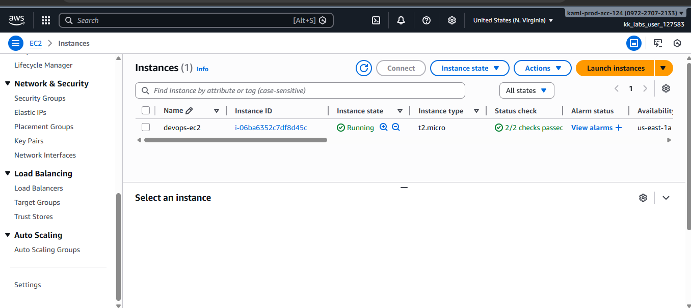
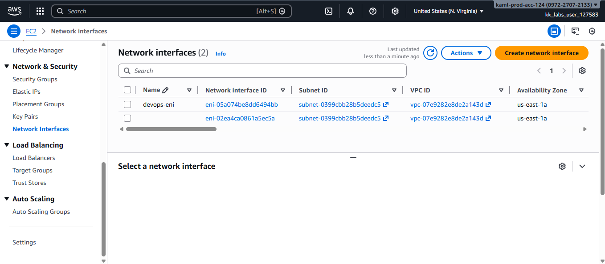
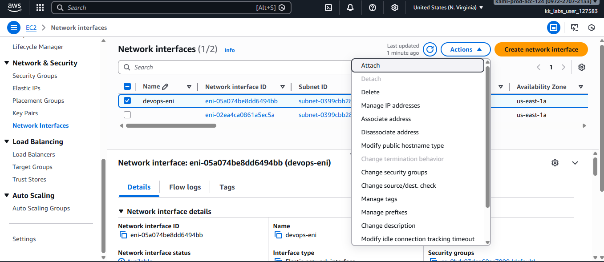
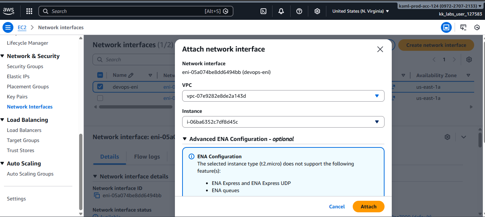
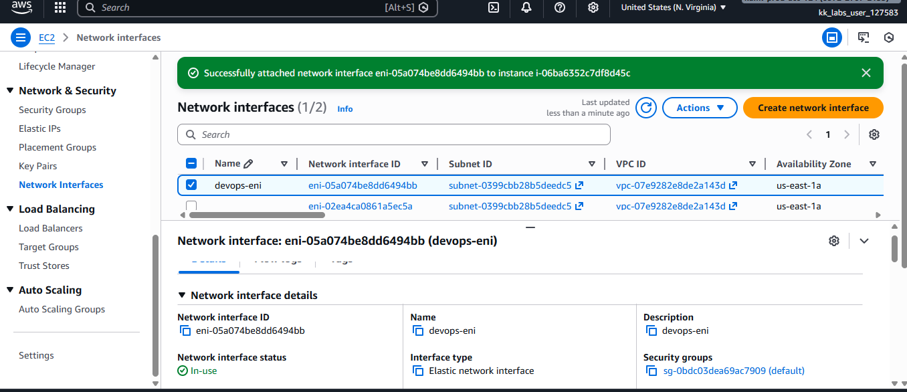
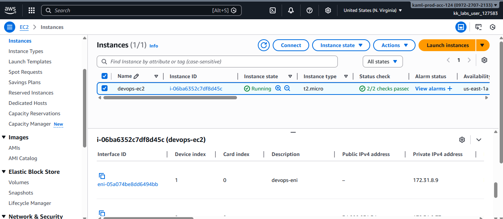

# Attach-an-Elastic-Network-Interface-to-an-EC2-Instance

This guide demonstrates how to attach an existing **Elastic Network Interface (ENI)** to an existing **EC2 instance** using the **AWS Management Console (GUI)**.

An Elastic Network Interface (ENI) is a virtual network card in AWS that you can attach to an EC2 instance to manage its network connectivity.
It allows you to assign IP addresses, security groups, and network settings independently from the instance, making it useful for traffic separation, high availability, and network isolation. An ENI can be detached from one instance and attached to another, which helps in failover and flexible network design.

## Step 1: Confirm EC2 Instance Status
1. Log in to the **AWS Management Console**
2. Navigate to **Services → EC2**
3. Click **Instances**
4. Select the instance of you want to use, in this case my own is **`devops-ec2`**
5. Confirm:
   - Instance state is **Running**
   - Status checks show **2/2 checks passed**

## Step 2: Navigate to Network Interfaces
1. In the EC2 dashboard sidebar, scroll to **Network & Security**
2. Click **Network Interfaces**
3. Locate the ENI that you want to attach to the instance
4. Confirm the status is **Available**

## Step 3: Attach the ENI to the EC2 Instance
1. Select **`devops-eni`**
2. Click **Actions → Attach**
3. In the attach dialog:
   - **Instance**: `devops-ec2`
4. Click **Attach**

## Step 4: Verify Attachment
1. Stay on the **Network Interfaces** page
2. Select **`devops-eni`**
3. Confirm:
   - Status is **In-use**
   - Attached instance is **`devops-ec2`**

## Notes
- Elastic Network Interfaces allow EC2 instances to have multiple network interfaces for use cases such as:
  - Network isolation
  - High availability
  - Traffic separation

